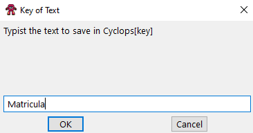
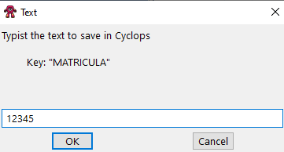
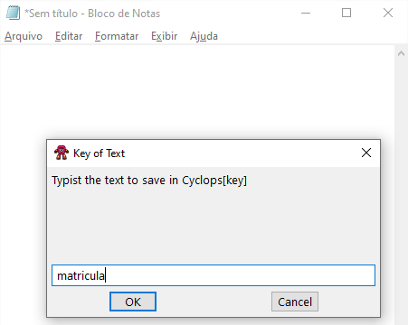
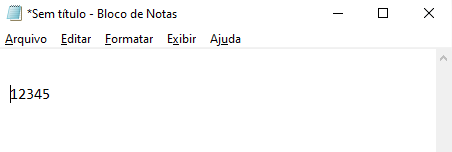
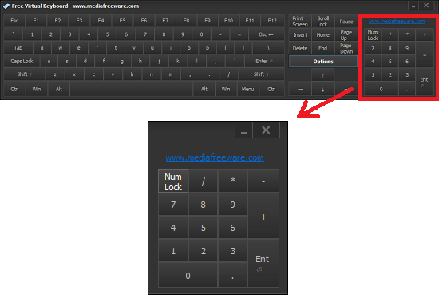

# Cyclops

- [Cyclops](#cyclops)
  - [O que é o Cyclops?](#o-que-é-o-cyclops)
  - [Quando posso utilizar o Cyclops?](#quando-posso-utilizar-o-cyclops)
  - [Experimente Rápido](#experimente-rápido)
  - [Texto Rápido](#texto-rápido)
    - [Associação com Letras / Números](#associação-com-letras--números)
    - [Observações](#observações)
      - [Associar Texto](#associar-texto)
      - [Escrever Texto](#escrever-texto)
    - [Salvar Texto com uma Chave Personalizada](#salvar-texto-com-uma-chave-personalizada)
      - [Salvar Texto com Chave Personalizada](#salvar-texto-com-chave-personalizada)
      - [Escrever Texto Associado a Chave Personalizada](#escrever-texto-associado-a-chave-personalizada)
  - [Executar Arquivos/URL](#executar-arquivosurl)
    - [Observações](#observações-1)
    - [Associar Arquivo/URL](#associar-arquivourl)
    - [Executar Arquivo/URL](#executar-arquivourl)
  - [Windows Switcher / Alternador de Janelas](#windows-switcher--alternador-de-janelas)
    - [Observações](#observações-2)
    - [Teclado Númerico | Numpad](#teclado-númerico--numpad)
    - [Associar uma Janela](#associar-uma-janela)
    - [Ativar Janela](#ativar-janela)
  - [Outras Funções](#outras-funções)
  - [Observações Importantes](#observações-importantes)
  - [LICENÇA MIT](#licença-mit)

 

## O que é o Cyclops?

**Cyclops** é um aplicativo desenvolvido na linguagem de Script chamada [AutoHotkey](https://www.autohotkey.com) que tem por objetivo tornar o usuário mais eficiente ao utilizar o Sistema Operacional Windows. Especialmente desenvolvedores.

Mais rápido que Billy the Kid utilizando o <kbd>Alt</kbd> + <kbd>Tab</kbd>, agiliza a troca direcionada entre programas abertos do Sistema.

Com mais memória que um Elefante com SSD, facilita a associação e recuperação de textos com atalhos em cada Letra/Número do teclado.

Sem precisar digitar aquele endereço enorme da Web, e sem precisar utilizar o Menu Iniciar ou Atalhos da Área de Trabalho. "Uff!! Cansei!". Você pode abrir programas ou sites com apenas um atalho.

Se você é afixionado por atalhos assim como eu, então este aplicativo é para você!!!

 

## Quando posso utilizar o Cyclops?

- Quando você deseja armazenar alguma informação onde digitaria em formulários.
  - Nome
  - E-mail
  - Usuário
  - Matrícula
- Para desenvolvedores: você pode utilizar para armazenar dados de usuário e senha em testes
- Para desenvolvedores: armazenar _select's_ que você utiliza com frequencia ("select precisa estar em apenas 1 linha")
- Para desenvolvedores: armazenar _comandos prompt_: "git log --graph --oneline"
- Quando você deseja alternar entre janelas do Windows, mais rápido que o <kbd>Alt</kbd> + <kbd>Tab</kbd> sonharia ser capaz de fazer.
- Quero abrir um programa mais rápido, com apenas um atalho, sem precisar clicar no atalho da Área de Trabalho ou ir ao Menu Iniciar

 

## Experimente Rápido

1. <kbd>Alt</kbd> + <kbd>Win</kbd> + <kbd>C</kbd> - Digite um texto qualquer.

2. <kbd>Ctrl</kbd> + <kbd>Alt</kbd> + <kbd>1</kbd> - Abrir o Bloco de Notas.

3. <kbd>Alt</kbd> + <kbd>Shift</kbd> + <kbd>C</kbd> - Será digitado o texto que você associou a Letra C.

 

## Texto Rápido

### Associação com Letras / Números

Com esta funcionalidade você pode armazenar um texto, frase, palavra, números ou letras, associando com uma tecla, e recuperar rapidamente esta informação através de atalhos.

 

### Observações

- Você pode utilizar todas as letras [A..Z] e números [0..9] do teclado normal (não é o teclado numérico).
- O aplicativo realmente digita o texto associado. Como se cada tecla fosse pressionada.
- Todos os textos armazenados são salvos em apenas uma linha de texto.
- Não é possível armazenar um texto que possui múltiplas linhas à uma única chave. (Não é multilinha)

 

#### Associar Texto

| Atalho                                         | Descrição                                   |
| ---------------------------------------------- | ------------------------------------------- |
| <kbd>Alt</kbd> + <kbd>Win</kbd> + <kbd>A</kbd> | Associa um texto a Letra A                  |
| <kbd>Alt</kbd> + <kbd>Win</kbd> + <kbd>B</kbd> | Associa um texto a Letra B                  |
| <kbd>Alt</kbd> + <kbd>Win</kbd> + <kbd>C</kbd> | Associa um texto a Letra C                  |
| ...                                            | Associa com cada Letra do Teclado           |
| <kbd>Alt</kbd> + <kbd>Win</kbd> + <kbd>Z</kbd> | Associa um texto a Letra Z                  |
| <kbd>Alt</kbd> + <kbd>Win</kbd> + <kbd>1</kbd> | Associa um texto a Tecla 1                  |
| <kbd>Alt</kbd> + <kbd>Win</kbd> + <kbd>2</kbd> | Associa um texto a Tecla 2                  |
| ...                                            | Associa um texto com cada Número do Teclado |
| <kbd>Alt</kbd> + <kbd>Win</kbd> + <kbd>0</kbd> | Associa um texto a Tecla 0                  |

 

#### Escrever Texto

| Atalho                                           | Descrição                                         |
| ------------------------------------------------ | ------------------------------------------------- |
| <kbd>Alt</kbd> + <kbd>Shift</kbd> + <kbd>A</kbd> | Escreve texto associado a Letra A                 |
| <kbd>Alt</kbd> + <kbd>Shift</kbd> + <kbd>B</kbd> | Escreve texto associado a Letra B                 |
| <kbd>Alt</kbd> + <kbd>Shift</kbd> + <kbd>C</kbd> | Escreve texto associado a Letra C                 |
| ...                                              | Escreve texto associado com cada Letra do Teclado |
| <kbd>Alt</kbd> + <kbd>Shift</kbd> + <kbd>Z</kbd> | Escreve texto associado a Letra Z                 |
| <kbd>Alt</kbd> + <kbd>Shift</kbd> + <kbd>1</kbd> | Escreve texto associado a Tecla 1                 |
| <kbd>Alt</kbd> + <kbd>Shift</kbd> + <kbd>2</kbd> | Escreve texto associado a Tecla 2                 |
| ...                                              | Escreve texto associado com Número do Teclado     |
| <kbd>Alt</kbd> + <kbd>Shift</kbd> + <kbd>0</kbd> | Escreve texto associado a Tecla 0                 |

 

### Salvar Texto com uma Chave Personalizada

Talvez você queira associar um Texto a uma Palavra específica para seu contexto. Neste caso você pode armazenar uma chave personalizada.

 

#### Salvar Texto com Chave Personalizada

**Input:** Faz a associação com uma chave personalizada

<kbd>Ctrl</kbd> + <kbd>Alt</kbd> + <kbd>Win</kbd> + <kbd>I</kbd>

Você pode utilizar a palavra "Matrícula" como **Chave** e associar o Texto "12345"

- Informando a Chave Personalizada

  

- Informando o Texto que será associado a esta Chave

  

_Matricula=12345_

 

#### Escrever Texto Associado a Chave Personalizada

**Output:** Escreve o texto associado a chave personalizada

Para recuperar esta informação você pode utilizar o atalho

<kbd>Ctrl</kbd> + <kbd>Alt</kbd> + <kbd>Win</kbd> + <kbd>O</kbd>

- Informando a Chave Personalizada

  

- Será digitado, na Tela que estiver ativa, o texto associado a Chave

  

 

## Executar Arquivos/URL

Com o Cyclops você consegue associar um arquivo [\*.exe, \*.pdf, \*.xls] ou um endereço da web [https://google.com.br] para abrir automaticamente utilizando apenas um atalho

### Observações

- Para arquivos é necessário informar o caminho completo do arquivos
- Também funciona com o path (endereço completo) dos atalhos na área de trabalho
- Para endereço da web você deve informar com o "HTTPS://" na frente
- Páginas da Internet serão abertas no navegador padrão do sistema

### Associar Arquivo/URL

| Atalho                                          | Descrição                                         |
| ----------------------------------------------- | ------------------------------------------------- |
| <kbd>Ctrl</kbd> + <kbd>Win</kbd> + <kbd>A</kbd> | Associa um arquivo/url a Letra A                  |
| <kbd>Ctrl</kbd> + <kbd>Win</kbd> + <kbd>B</kbd> | Associa um arquivo/url a Letra B                  |
| <kbd>Ctrl</kbd> + <kbd>Win</kbd> + <kbd>C</kbd> | Associa um arquivo/url a Letra C                  |
| ...                                             | Associa um arquivo/url com cada Letra do Teclado  |
| <kbd>Ctrl</kbd> + <kbd>Win</kbd> + <kbd>Z</kbd> | Associa um arquivo/url a Letra Z                  |
| <kbd>Ctrl</kbd> + <kbd>Win</kbd> + <kbd>1</kbd> | Associa um arquivo/url a Tecla 1                  |
| <kbd>Ctrl</kbd> + <kbd>Win</kbd> + <kbd>2</kbd> | Associa um arquivo/url a Tecla 2                  |
| ...                                             | Associa um arquivo/url com cada Número do Teclado |
| <kbd>Ctrl</kbd> + <kbd>Win</kbd> + <kbd>0</kbd> | Associa um arquivo/url a Tecla 0                  |

### Executar Arquivo/URL

| Atalho                                          | Descrição                                                  |
| ----------------------------------------------- | ---------------------------------------------------------- |
| <kbd>Ctrl</kbd> + <kbd>Win</kbd> + <kbd>A</kbd> | Executa um arquivo/url associado a Letra A                 |
| <kbd>Ctrl</kbd> + <kbd>Win</kbd> + <kbd>B</kbd> | Executa um arquivo/url associado a Letra B                 |
| <kbd>Ctrl</kbd> + <kbd>Win</kbd> + <kbd>C</kbd> | Executa um arquivo/url associado a Letra C                 |
| ...                                             | Executa um arquivo/url associado com cada Letra do Teclado |
| <kbd>Ctrl</kbd> + <kbd>Win</kbd> + <kbd>Z</kbd> | Executa um arquivo/url associado a Letra Z                 |
| <kbd>Ctrl</kbd> + <kbd>Win</kbd> + <kbd>1</kbd> | Executa um arquivo/url associado a Tecla 1                 |
| <kbd>Ctrl</kbd> + <kbd>Win</kbd> + <kbd>2</kbd> | Executa um arquivo/url associado a Tecla 2                 |
| ...                                             | Executa um arquivo/url associado com Número do Teclado     |
| <kbd>Ctrl</kbd> + <kbd>Win</kbd> + <kbd>0</kbd> | Executa um arquivo/url associado a Tecla 0                 |

 

## Windows Switcher / Alternador de Janelas

Você pode alterar rapidamente entre janelas do Windows sem utilizar o <kbd>Alt</kbd> + <kbd>Tab</kbd> e indo direto para a janela que você deseja, sem precisar ficar escolhendo em uma lista.

 

### Observações

- Esta funcionalidade está habilitada apenas para o Teclado Número (Numpad).
- Você pode associar janelas do Windows aos números do Teclado Numérico de 0 a 9.
- Precisa informar o título ou parte do título da janela que você deseja associar.
- É case-sensitive, considera diferença entre maíuscula e mínuscula.
- Funciona com parte do Título da Janela. Não precisa ser o título completo.
- Há um atalho, em **Outras Funções** para copiar o título da janela ativa.

 

### Teclado Númerico | Numpad

]

 

### Associar uma Janela

| Atalho                                                | Descrição                                 |
| ----------------------------------------------------- | ----------------------------------------- |
| <kbd>Win</kbd> + <kbd>Alt</kbd> + <kbd>NUMPAD 0</kbd> | Associa uma janela do Windows ao Número 0 |
| <kbd>Win</kbd> + <kbd>Alt</kbd> + <kbd>NUMPAD 1</kbd> | Associa uma janela do Windows ao Número 1 |
| ...                                                   |                                           |
| <kbd>Win</kbd> + <kbd>Alt</kbd> + <kbd>NUMPAD 9</kbd> | Associa uma janela do Windows ao Número 2 |

 

### Ativar Janela

| Atalho                                                 | Descrição                                               |
| ------------------------------------------------------ | ------------------------------------------------------- |
| <kbd>Win</kbd> + <kbd>Ctrl</kbd> + <kbd>NUMPAD 0</kbd> | Ativa a janela do Windows com Título associado Número 0 |
| <kbd>Win</kbd> + <kbd>Ctrl</kbd> + <kbd>NUMPAD 1</kbd> | Ativa a janela do Windows com Título associado Número 1 |
| ...                                                    |                                                         |
| <kbd>Win</kbd> + <kbd>Ctrl</kbd> + <kbd>NUMPAD 9</kbd> | Ativa a janela do Windows com Título associado Número 9 |

 

## Outras Funções

| Atalho                                                             | Descrição                      |
| ------------------------------------------------------------------ | ------------------------------ |
| <kbd>Ctrl</kbd> + <kbd>Alt</kbd> + <kbd>NUMPAD 1</kbd>             | Abre o bloco de notas          |
| <kbd>Ctrl</kbd> + <kbd>Alt</kbd> + <kbd>1</kbd>                    | Abre o bloco de notas          |
| <kbd>Ctrl</kbd> + <kbd>Alt</kbd> + <kbd>NUMPAD 2</kbd>             | Abre a calculadora             |
| <kbd>Ctrl</kbd> + <kbd>Alt</kbd> + <kbd>2</kbd>                    | Abre a calculadora             |
| <kbd>Ctrl</kbd> + <kbd>Win</kbd> + <kbd>Shift</kbd> + <kbd>N</kbd> | Copia o título da janela ativa |
| <kbd>Ctrl</kbd> + <kbd>Win</kbd> + <kbd>Shift</kbd> + <kbd>W</kbd> | Ativa todas as janelas abertas |
| <kbd>Ctrl</kbd> + <kbd>Win</kbd> + <kbd>Shift</kbd> + <kbd>C</kbd> | Fecha todas as janelas abertas |
| <kbd>Ctrl</kbd> + <kbd>Win</kbd> + <kbd>Alt</kbd> + <kbd>8</kbd>   | Reinicia o Sistema Operacional |
| <kbd>Ctrl</kbd> + <kbd>Win</kbd> + <kbd>Alt</kbd> + <kbd>5</kbd>   | Hiberna o Sistema Operacional  |
| <kbd>Ctrl</kbd> + <kbd>Win</kbd> + <kbd>Alt</kbd> + <kbd>0</kbd>   | Desliga o Sistema Operacional  |

 

## Observações Importantes

- Todos os textos e atalhos são armazenados em um arquivos **.ini** criado no mesmo diretório do executável.
- Os dados que você informa não são compartilhados na nuvem ou em lugar algum.
- Todos os textos e atalhos ficam somente no seu computador.

 

## LICENÇA MIT

Este aplicativo foi desenvolvido para facilitar meu trabalho, me tornando mais produtivo e eficiente. Espero que ele possa ser tão útil para você quanto é para mim.
É totalmente gratuito e está sob a Licença MIT, podendo ser utilizado e distribuido livremente.

**Enjoy It!!!**

 

Icons made by <a href="https://www.flaticon.com/authors/smashicons" title="Smashicons">Smashicons</a> from <a href="https://www.flaticon.com/" title="Flaticon">www.flaticon.com</a>

